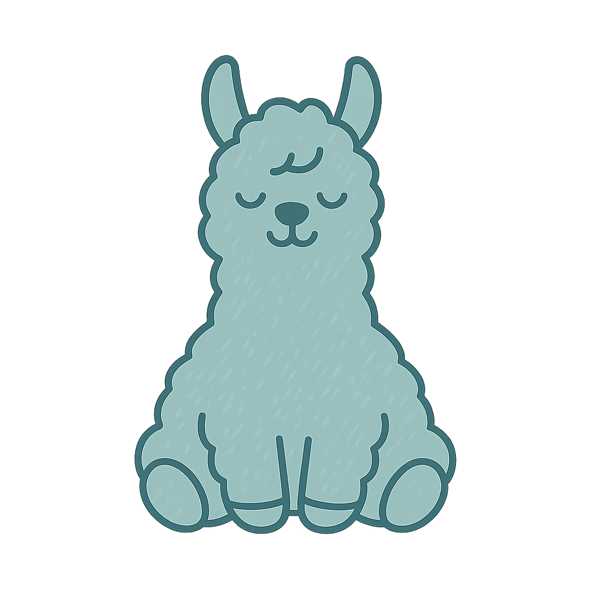

# 🧵 The Crafting Llama

**A Personalized Embroidery Experience, One Stitch at a Time**

---

Welcome to **The Crafting Llama**, a lovingly handcrafted platform for custom embroidery orders. Whether you're shopping for a one-of-a-kind gift or designing something meaningful for yourself, this site helps you personalize your order from start to stitch.

---

## ✨ What You Can Do

- 🧶 **Create Custom Orders**
    - Choose from a variety of embroidery design themes
    - Customize fields like names, colors, seasonal motifs, and more
    - Preview and review each item before placing your order

- 🧵 **Explore the Gallery**
    - Browse past creations and seasonal designs for inspiration

- 📬 **Contact Me**
    - Reach out with questions or custom requests through the built-in contact form

---

## 🧵 About the Site

This site was built from the thread up using modern web technologies:

- 💡 **Angular 20+** with a focus on accessibility, performance, and design polish
- 🌈 **Tailored color picker and dynamic forms** built for embroidery use cases
- 🗂️ **Supabase** powers real-time content management, gallery updates, and form storage
- ⚙️ **Admin tools** for managing designs, variants, colors, and incoming messages

---

## ❗ Contribution Policy

This is a **personal project** built and maintained by me for my wife’s handcrafted embroidery business. While the code is open for viewing and learning, external contributions are not currently accepted.

Feel free to reach out if you’re curious about the tech or want to say hi!

---

## 📮 Contact

📧 [TheCraftingLlamaStitching@gmail.com](mailto:thecraftingllamastitching@gmail.com)  
📸 Instagram: [@TheCraftingLlama](https://instagram.com/thecraftingllama)  
🌐 Live site: [https://craftingllama.com](https://craftingllama.com)  
🐦 My X (Twitter): [@PiousProgrammer](https://x.com/PiousProgrammer)

---

## 🪡 License

MIT License — for learning and reference use only.  
No reproduction or reuse of branding or designs without permission.

© 2025 The Crafting Llama
